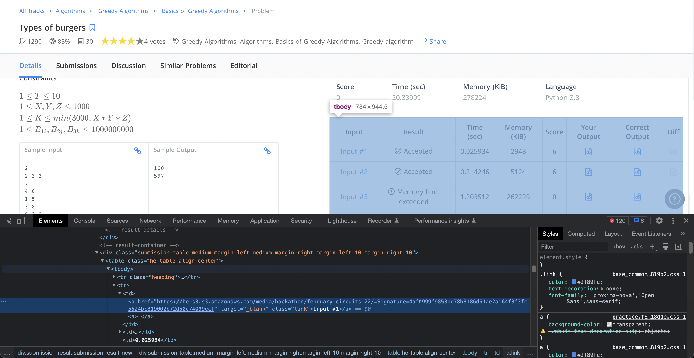
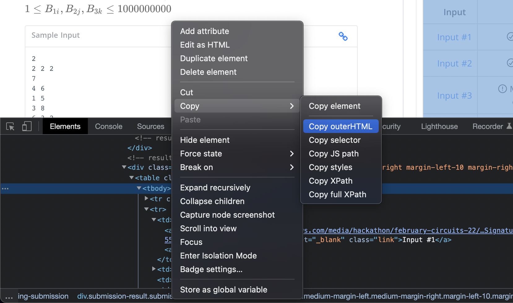
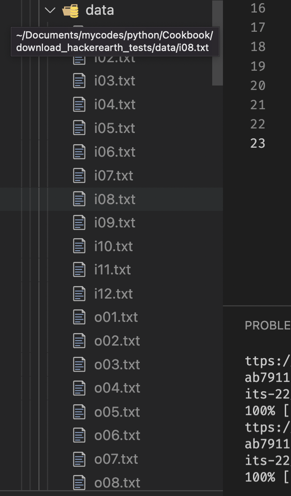

Hướng dẫn dùng tool.

Vì tool được viết ra 1 cách rất cơ bản bằng python, nên đọc code để hiểu là việc ez. Nhưng vẫn có hướng dẫn dưới đây.

1. Cài python >= 3.9
2. Dùng terminal mở đến thư mục này (dùng vscode luôn cho tiện). Chạy cáu lệnh sau:

    `pip install requirements.txt`
3. Vào bài dịch trên hackerearth, submit với code bất kì (để hiện ra tất cả test case). Click chuột trái, chọn *inspect element* (hoặc chỉ là *inspect* với Chrome).
4. Tìm đến phần *input* như hình:

5. Ở thẻ \<tbody\>, copy html

6. Chọn file `example.html`, paste nội dung vừa copy vào đấy.
7. Chạy file `download_test.py`. Chương trình sẽ hỏi tên của bài. Nếu để trống thì sẽ đặt tên là `data`, ngược lại sẽ tự động nén thành file `Tên file.zip`
Các test sẽ nằm ở folder `downloaded/Tên file` và file `downloaded/Tên file.zip`.
(nếu đã tồn tại folder này thì cần xoá trước khi chạy)

